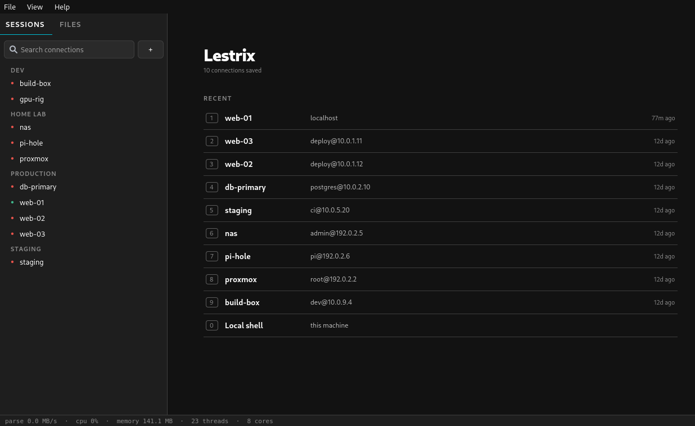
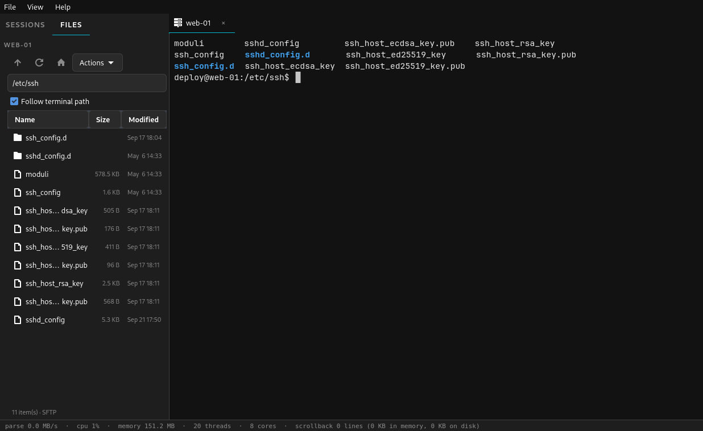

# Lestrix

<p align="center">
  
</p>

A fast, light SSH terminal manager in plain C. No GTK, no Qt: the window, the widgets and the text rendering are its own code on SDL2 and OpenGL. Saved connections on the left, terminal tabs on the right, an SFTP/FTP file browser that follows your shell, and a live performance bar along the bottom. Think MobaXterm, built to start instantly and stay small.

<p align="center">
  
</p>

**Version:** 0.2.2  
**Author:** BeanGreen247  
**License:** MIT

## Highlights

- **Fast.** Its own terminal engine parses ~230 MB/s with scrollback on, ~900 MB/s with it off, and each tab parses on its own thread.
- **Light.** About 100 MB of RAM with the GPU renderer, and scrollback is compressed and spilled to disk, so even "unlimited" stays bounded.
- **Reads what you already have.** `~/.ssh/config` (with `Include`), your keys and agent, and Ansible inventories (INI with host ranges and group vars, or YAML).
- **SSH, SFTP, scp, FTP and FTPS, X11 forwarding.** SSH uses the system `ssh`, so ProxyJump, IdentityFile and the rest keep working. The file browser rides the same connection, so there is no second login.
- **Works as your terminal.** `lestrix -e htop` works as `x-terminal-emulator`, and it installs a menu entry under System.
- **Six themes** and a custom accent colour.



## Install

You need a system with OpenGL 3.3, OpenGL ES 3.0 or ES 2.0 (any GPU from the last decade, a Raspberry Pi 2 to 5 or other Mesa-driven board, or Mesa's software driver), SDL2, FreeType and fontconfig, plus the OpenSSH client. The installer fetches the development packages for the build and the Mesa libraries for run time (apt, dnf, pacman and zypper are supported).

```bash
git clone https://github.com/BeanGreen247/lestrix.git
cd lestrix
./install.sh             # a full-screen installer (dialog or whiptail): pick the options, then confirm
```

The installer asks what you want (install, update or remove) and a few options: install the missing system packages, make Lestrix the default terminal, install system-wide instead of into your home folder, and run the test suite. Nothing changes until you confirm on the last screen. Without `dialog` or `whiptail`, or with `--plain`, it asks plain questions in the terminal. To skip the questions:

```bash
./install.sh --yes --deps                # install the build packages, build, install with the default settings
./install.sh --yes --prefix /usr/local --no-default-terminal
./install.sh --uninstall                 # --purge also deletes your saved data
./install.sh --dry-run                   # show what would be run, change nothing
```

Lestrix runs on Linux (X11 or Wayland, through SDL2); there is no Windows or macOS build yet. The installer calls `native/install.sh`, which does the build and the install and can be used directly. It is safe to re-run: it rebuilds and replaces the installed copy. `--no-deps` never touches system packages.

By default it also sets Lestrix as the default terminal, with settings that need no privileges where possible: the first entry in `~/.config/xdg-terminals.list` (the xdg-terminal-exec convention), GNOME's default-terminal setting, Xfce's preferred terminal, and KDE's `TerminalApplication`; on Debian and Ubuntu it also registers the `x-terminal-emulator` alternative, which needs `sudo`. It prints each thing it changed, and uninstalling gives them back (only entries that point at Lestrix are touched). It also installs `lxcat`, the fast `cat` described below.

**Uninstall**

```bash
./install.sh --uninstall # or ./native/uninstall.sh: removes the binary, menu entry, icon and build output; keeps your connections
./install.sh --uninstall --purge   # also deletes saved connections, settings and leftover history files
```

## Using it

```bash
lestrix --benchmark            # measure this machine
lestrix --connect my-server    # open a saved connection on startup
lestrix --theme Nord           # Xylonic Dark/Light, Graphite, Nord, Gruvbox, Solarized Dark
lestrix -e htop                # works as x-terminal-emulator
lestrix --local --working-directory ~/src
```

Connections live in `~/.config/lestrix/connections.json`. No passwords are saved; ssh asks in the terminal or uses your key and agent. FTP and FTPS ask for the password when you connect.

## Under the hood

The program lives in `native/` and is plain C (GNU C11, not C++): its own terminal engine, its own widget toolkit, drawing and text rendering on SDL2 (windowing and input) and OpenGL (3.3, ES 3.0 or ES 2.0), FreeType and fontconfig for fonts, and `libcurl` for FTP. (An earlier Python/Qt prototype where the features were worked out was removed in 0.2.2; it is still in the git history before commit `26beddf`.)

### Speed is a feature

A terminal sits between you and everything you run. When it is slow, `tail -f` on a busy log lags, a build scrolls in jerks, and pasting a large file freezes the window. When it is wasteful, it takes memory and battery from the editor, the compiler and the browser next to it. So speed is treated as a requirement, not a nice extra:

- The numbers above are measured on one 8-core machine, not estimated, and `lestrix --benchmark` measures them on your machine.
- The bar along the bottom of the window shows them live (every figure is explained under [What the overlay shows](#what-the-overlay-shows), and hovering one in the app shows the same text). It is on by default; View > Show performance overlay turns it off.
- `make test` includes a speed gate that fails if parsing gets more than about ten times slower, so a slowdown cannot slip in unnoticed.

### Scrollback: adjustable, up to unlimited

View > Scrollback offers Off, 1,000, 10,000 (default), 100,000, 1,000,000 or Unlimited, and applies to open tabs at once. Settings under `[ui]` in `~/.config/lestrix/settings.ini` go further: `scrollback` (a line count, `-1` for unlimited), `scrollback_ram_mb` (default 32) and `scrollback_disk_mb` (default 4096).

It is built to stay inside its limits:

- The newest ~1,000 lines stay as they are. Older lines are packed 128 at a time: byte-shuffled, then compressed (a repetitive log line costs a few bytes; 118,000 log lines took 4.4 MB), on worker threads so parsing never waits for it.
- When the packed history passes the memory budget, the oldest blocks move to an unlinked temporary file. When that passes the disk budget, the oldest block is dropped. Memory and disk use are always bounded, even with "Unlimited".
- Scrolling back decodes blocks on demand into a small cache. Corrupt or unreadable blocks show as empty lines instead of crashing.
- The compressor's decoder checks every length and offset; a fuzz test throws thousands of damaged blocks at it under ASan/UBSan, and the worker threads run under ThreadSanitizer.

### Cores and threads

Each terminal parses on its own thread, so the window stays responsive during a flood and several busy tabs run on separate cores. Scrollback compression runs on a pool of up to 16 workers, and file transfers, connection checks and the SFTP browser run on background threads too. One terminal's output is a single ordered stream, so one tab is parsed by one core by nature; the cores are used when there is more than one thing to do.

### Current revision: full benchmark, all terminals

Same machine as below (Intel i5-8265U, 8 threads, Debian 13, X11), 200x50 windows at default settings, one run each, the `native/benchmark` script with this revision of Lestrix (rows 15-27 of the progression below). Every test ends with a cursor-position request that a terminal only answers after it has parsed everything before it, so the times are "until it has taken it all". **Lestrix (cat)** is Lestrix running plain `cat`, the same test every terminal gets; **Lestrix (lxcat)** is Lestrix's fast file path, which other terminals cannot do, so it is a separate column and not a like-for-like comparison. mate-terminal is left out: it hands its command to an already running server, so the script cannot measure it reliably. Best of the like-for-like terminals is in bold.

| Total time, seconds | Lestrix (cat) | Lestrix (lxcat) | Alacritty | kitty | GNOME Terminal | Xfce Terminal | xterm |
|---|---|---|---|---|---|---|---|
| 107 MB log | **1.29** | 0.25 | 2.28 | 2.29 | 2.72 | 2.69 | 5.39 |
| 40 MB colour text | **0.56** | 0.18 | 0.78 | 0.90 | 1.01 | 1.08 | 2.03 |
| 30 MB Unicode text | **0.38** | 0.37 | 0.72 | 0.66 | 1.33 | 1.38 | 1.48 |
| `seq 1 4000000` | 1.50 | 0.28 | **1.04** | 2.77 | 2.11 | 2.19 | 4.14 |
| 1,500 full-screen redraws | **0.10** | 0.04 | 0.23 | 0.24 | 0.23 | 0.24 | 1.36 |
| 1 GB of letters, no newline (refterm `-longline`) | **6.40** | 2.88 | 19.93 | 17.18 | 191.09 | 36.25 | 42.72 |
| 1 GB of letters with a newline every ~27 (refterm `-manyline`) | 28.27 | 5.65 | 29.89 | 43.35 | 42.55 | 44.40 | 76.07 |
| 128 MB random text | **3.41** | 0.69 | 3.64 | 3.71 | 6.73 | 6.88 | 8.49 |
| 512 MB random text | **14.34** | 2.84 | 16.12 | 15.86 | 28.48 | 29.30 | 34.62 |
| 1 GB random text | **30.64** | 5.80 | 33.94 | 33.56 | 58.70 | 59.77 | 70.77 |
| 2 GB random text | **63.01** | 11.98 | 68.43 | 67.41 | 117.90 | 120.25 | 141.71 |

| CPU used, seconds | Lestrix (cat) | Lestrix (lxcat) | Alacritty | kitty | GNOME Terminal | Xfce Terminal | xterm |
|---|---|---|---|---|---|---|---|
| 107 MB log | **1.01** | 0.61 | 2.40 | 3.33 | 2.29 | 2.28 | 5.37 |
| 40 MB colour text | **0.43** | 0.26 | 0.83 | 1.11 | 0.93 | 0.99 | 2.01 |
| `seq 1 4000000` | **0.88** | 0.64 | 1.08 | 3.67 | 1.99 | 2.04 | 4.13 |
| 1 GB `-manyline` | **21.60** | 14.19 | 31.63 | 63.02 | 36.94 | 38.45 | 76.02 |
| 1 GB random text | **24.85** | 20.57 | 36.11 | 58.28 | 51.54 | 52.77 | 70.69 |
| 2 GB random text | **51.62** | 42.14 | 72.86 | 117.03 | 104.14 | 105.77 | 141.57 |

| | Lestrix (cat) | Lestrix (lxcat) | Alacritty | kitty | GNOME Terminal | Xfce Terminal | xterm |
|---|---|---|---|---|---|---|---|
| Start-up to first prompt | 0.18 s | 0.19 s | 0.24 s | 0.81 s | 0.38 s | 0.27 s | **0.10 s** |
| Memory at rest | 97 MB | 97 MB | 99 MB | 126 MB | 55 MB | 53 MB | **11 MB** |
| Peak memory | 110 MB | 153 MB | 149 MB | 149 MB | 72 MB | 71 MB | **16 MB** |
| Idle CPU over 6 s | 0.03 s | 0.03 s | **0.00 s** | **0.00 s** | 0.01 s | **0.00 s** | **0.00 s** |

Where Alacritty is level or ahead: `seq` (1.04 s against 1.50 s), the 1 GB `-manyline` file (29.9 s against 28.3 s, a tie), and idle CPU (0.00 s against 0.03 s). Random text is a near tie (0.029-0.034 GB/s for Alacritty and kitty, 0.032-0.037 GB/s for Lestrix) because the kernel's pty is the limit there, which the "Why nobody can go faster" part of `native/docs/BENCHMARKS.md` measures; Lestrix is ahead on CPU in every test. Everything uses one run, so differences under about 5% are noise.

### How it compares (earlier revision)

The table below is the earlier measurement, taken before the work in rows 15-27 of the progression and with an older harness (it timed the command, not the parse), so its Lestrix column is the previous revision and the two tables should not be mixed.


Eight terminals side by side on one machine (Intel i5-8265U, 8 threads, Debian 13, X11). Lestrix is the full application (`lestrix -e script`), not a test harness. Each terminal runs the same script at default settings in a 200x50 window (Lestrix in its normal window with the sidebar). Every test is a `cat` of a prepared file, except the `seq` test, timed from the start of the command to its end with the terminal drawing everything. CPU is user + system time of the terminal process over that test, all threads. Lestrix numbers are the median of three runs, the others are single runs; the best value in each row is in bold (within 3%).

| | Lestrix | Alacritty | kitty | mate-terminal | GNOME Terminal | Xfce Terminal | xterm |
|---|---|---|---|---|---|---|---|
| Startup to first prompt | 0.18 s | 0.19 s | 0.96 s | 0.22 s | 0.39 s | 0.34 s | **0.09 s** |
| `cat` 107 MB log | **1.4 s** | 2.5 s | 2.7 s | 3.2 s | 3.3 s | 3.4 s | 6.4 s |
| `cat` 40 MB colour-heavy | **0.42 s** | 0.92 s | 1.08 s | 1.36 s | 1.35 s | 1.43 s | 2.14 s |
| `cat` 30 MB Unicode text | **0.35 s** | 0.90 s | 0.78 s | 1.68 s | 1.84 s | 1.82 s | 1.98 s |
| `seq 1 4000000` (4M short lines) | **1.16 s** | 1.29 s | 3.32 s | 2.64 s | 2.59 s | 2.68 s | 5.20 s |
| 1,500 full-screen redraws (11 MB) | **0.06 s** | 0.22 s | 0.23 s | 0.18 s | 0.24 s | 0.30 s | 1.46 s |
| CPU used, log | **2.1 s** | 2.7 s | 4.0 s | 2.7 s | 2.9 s | 3.0 s | 6.4 s |
| CPU used, colour | **0.57 s** | 0.99 s | 1.38 s | 1.25 s | 1.25 s | 1.32 s | 2.13 s |
| CPU used, Unicode | **0.58 s** | 0.94 s | 1.17 s | 1.52 s | 1.66 s | 1.64 s | 1.98 s |
| CPU used, seq | **1.35 s** | **1.35 s** | 4.29 s | 2.47 s | 2.42 s | 2.49 s | 5.18 s |
| CPU used, redraws | **0.06 s** | 0.24 s | 0.27 s | 0.16 s | 0.23 s | 0.28 s | 1.00 s |
| Idle CPU over 6 s | 0.02 s | **0.00 s** | 0.02 s | **0.00 s** | **0.00 s** | **0.00 s** | **0.00 s** |
| Peak memory after the runs | 106 MB | 148 MB | 146 MB | 67 MB | 68 MB | 66 MB | **16 MB** |
| Memory at rest | 104 MB | 148 MB | 146 MB | 66 MB | 66 MB | 65 MB | **16 MB** |

How to read it:

- **Speed:** Lestrix is fastest on the plain log, colour, Unicode, scroll-heavy and full-screen redraw tests. On the 107 MB log it is 1.7x faster than Alacritty and 1.8x faster than kitty; on colour text 2.4x and 2.8x; on the redraw test (the pattern `vim` and `htop` produce) about 3x. The VTE terminals take twice as long or more on every one of these.
- **CPU:** it uses the least CPU on the colour, Unicode and redraw tests, and is level with the VTE terminals and Alacritty on the log. Alacritty is lighter on `seq` (1.35 s against about 1.5 s).
- **Start-up:** about 0.18 s, ahead of Alacritty (0.19 s) and mate-terminal (0.22 s); only xterm (0.09 s) is quicker.
- **Memory:** Lestrix uses about 105 MB, which is less than Alacritty and kitty (about 147 MB) but more than the VTE terminals (about 66 MB) and xterm (16 MB). Scrollback stays bounded however long a tab runs.
- **Ceiling:** on this machine the kernel's pty hands a reader at most about 68 MB/s however large the reads are (measured with a bare Python reader), so no terminal can finish the 107 MB `cat` in under about 1.5 s. Lestrix is at that ceiling.

#### Lestrix's parts, measured alone

Other terminals do not expose these stages, so there is nothing to put beside them; they show where Lestrix's time goes.

| Part | Speed |
|---|---|
| Terminal engine, scrollback off, no drawing | about 870-950 MB/s |
| Terminal engine, 10,000-line scrollback, no drawing | about 100-140 MB/s |
| Scrollback compressor, per core | about 7 GB/s (was 2.7 GB/s) |
| 118,000 log lines held in scrollback | 2.7 MB (packed 27x) |
| Whole app, 107 MB flood: CPU of all threads | about 2.0 s (the parser thread 1.3 s, drawing 0.25 s, the rest compression) |
| Redraw rate while output scrolls faster than it can be read | 30 frames per second |

What Lestrix adds beyond speed is one parser thread per tab so a flooding tab does not stall the others, scrollback that stays small, and SSH, SFTP/FTP and the sessions list in the same window.

### The final benchmark: a 1 GiB file of random text

The other tests use realistic files. This one is the last word: list a 1 GiB file of random printable ASCII, symbols, tabs and multi-byte UTF-8 (accents, Greek, box drawing, CJK, emoji) in lines of random length. Random text cannot be compressed or predicted, so no terminal gets a shortcut from repetition. The same seed always produces the same bytes, so every terminal prints identical output.

```
native/benchmark       # everything below, in every installed terminal, then a summary table
native/benchmark --quick --terminals lestrix   # 128 and 256 MB files, Lestrix only
```

The `benchmark` script (in `native/`; it is a standalone script, not part of the Lestrix program or its install) runs five everyday workloads (log, colour, Unicode, `seq`, full-screen redraws), the two stress files from Casey Muratori's refterm (`longline`: 1 GB of random letters with no newline at all, one endless wrapped line; `manyline`: 1 GB of random letters with a line break about every 27 characters; `--no-refterm` skips them) and random-text files of 128, 256, 512, 768 MB, 1 GB and 2 GB in each terminal (`--sizes`, `--terminals`, `--quick`, `--no-workloads`, `--no-sizes`, `--flags` pick a subset). `bench/run.sh` is what runs inside each terminal: it prints `total sink time: N ms  speed: X GB/s` on screen the moment each test ends, measures start-up, memory and idle CPU, writes `bench/results/` and a `summary.md`, and exits, which closes the terminal window. Windows open on your screen and close themselves; leave them alone while a run is going. Only one test file exists at any moment: it is generated just before its test, in `~/.cache/lestrix-bench` on disk (`--dir` changes it), and deleted right after, so nothing large stays in memory or on disk. With `--open browser` the results page opens in a private window of a separate browser instance with a throw-away profile, and everything temporary is deleted when you close it; only `bench/results/summary.md` stays.

What each column of the result means:

| Column | Meaning |
|---|---|
| `wall_ms` | Total sink time: from the start of `cat` to its end, in milliseconds. This is how long the terminal took to swallow and draw 1 GiB. Lower is better. |
| `GB/s` | The file size divided by that time. Higher is better. |
| `cpu_s` | CPU seconds the terminal process used during the run, all its threads (user + system). Lower is better: it is battery and fan noise. |
| `MB/cpu-s` | Megabytes handled per CPU second: throughput per unit of effort. Higher is better. |
| `peak_MB` | Highest resident memory the terminal reached. Lower is better. |
| `rest_MB` | Resident memory before the run started. |
| `idle_cpu` | CPU used over 6 quiet seconds afterwards. It should be about 0: a terminal that keeps spinning wastes power. |

Result on the same machine as the table above (Intel i5-8265U, Debian 13, X11; 200x50 windows, default settings, one run each, windows closed by the script):

| | Lestrix | Alacritty | kitty | xterm | mate-terminal | GNOME Terminal | Xfce Terminal |
|---|---|---|---|---|---|---|---|
| Total sink time | **32.8 s** (32,826 ms) | 37.9 s | 50.2 s | 113.0 s | 140.9 s | 142.4 s | 147.6 s |
| Speed | **0.030 GB/s** | 0.026 GB/s | 0.020 GB/s | 0.009 GB/s | 0.007 GB/s | 0.007 GB/s | 0.007 GB/s |
| CPU used | **39.7 s** | 40.4 s | 84.4 s | 112.4 s | 128.9 s | 129.9 s | 134.5 s |
| MB per CPU second | **26** | 25 | 12 | 9 | 8 | 8 | 8 |
| 26 | Split I/O: per tab a reader thread takes bytes off the pty into a ring of 8 buffers, the parser thread parses them, and a writer thread sends keys, pastes and replies (`--io-threads`, 2 from 4 cores up). Render helper threads (`--render-threads N`) exist but are off by default | through `cat` (the pty): Unicode text 0.92 -> 0.51 s, colour text 0.87 -> 0.71 s, full-screen redraws 0.43 -> 0.29 s, `seq` and log text within noise (log about 6% slower, 1.40 -> 1.50 s; CPU about 35% higher); clean under ThreadSanitizer (the only reports were inside the Mesa driver). Render threads: building a frame takes 0.52-0.56 ms either way and uncapped frame rate fell from 960 to 870 fps with 2 helpers, so they stay off |
| 27 | The 20 us read delay applies only to tiny reads (under 1 KB, a line at a time), the reader thread's timer slack is set to 1 ns, and the delay is 200 us. It had been delaying every read under 8 KB with the kernel's default 50 us of slack, which throttled streams of big reads (refterm `-longline`, colour text, redraws) and was found by the full benchmark | `-longline` 256 MB: 5.36 s -> 1.41 s; colour 0.70 -> 0.31 s, redraws 0.29 -> 0.08 s; random text 256 MB: CPU 11.0 s (20 us) -> 5.6 s (200 us) at the same wall time |
| Peak memory | 104 MB | 148 MB | 147 MB | **16 MB** | 76 MB | 68 MB | 67 MB |
| Idle CPU over 6 s afterwards | 0.02 s | **0.00 s** | **0.00 s** | **0.00 s** | 5.30 s* | **0.00 s** | **0.00 s** |

\* mate-terminal shares one server process between all its windows, so its figure includes whatever else that server was doing.

Reading it: on this file the kernel's pseudo-terminal is the bottleneck. A bare Python reader draining a pty as fast as it can manages about 34 MB/s here (about 31 s for 1 GiB), so no terminal can finish in less than that. Lestrix is within 5% of it; Alacritty is about 20% behind, kitty 60%, and the VTE terminals (GNOME, Xfce, mate) and xterm take three to five times as long. Lestrix and Alacritty need the least CPU for the job; xterm needs the least memory.

Lestrix draws at most 60 frames a second, and while a big dump is pouring in it slows itself to 24 (`--io-fps 24`), so the CPU goes to reading the output instead of drawing frames nobody can read; it returns to the normal rate as soon as the output slows. Both limits are command-line flags: `--max-fps N` (0 removes the cap and turns vsync off) and `--io-fps N` (lower is faster for output; 0 adds no extra limit). When nothing changes it draws nothing: an idle window with a focused cursor draws two frames a second (the blink), an unfocused one almost none, and the loop sleeps until the next timer instead of polling. On this machine 256 MB through `lxcat` took 1.98 s at 60 fps, 2.06 s at 120, 2.25 s at 240 and 3.2 s with no limit (about 700 frames a second), so a lower dump rate is the faster way to print a lot of text; for reference, kitty documents about 100 fps as "more than sufficient for most uses" and Ghostty defaults to vsync.

### lxcat: big files without the kernel's tty layer

Everything a program prints goes through the kernel's pseudo-terminal, which works on every line and caps big output at about 35 MB/s on this machine, whichever terminal is on the other end. `lxcat` is `cat` for Lestrix: in a local Lestrix tab it sends the terminal one escape sequence naming the file, and Lestrix reads the file itself at memory speed and prints it at exactly that point in the output, so ordering is unchanged. Elsewhere, or when its output is not a terminal, it behaves like `cat`. Piped input is copied to `/dev/shm` first and handed over the same way.

```
lxcat big.log            # same output as cat, 3-4x faster on big files
some-command | lxcat
```

In local Lestrix tabs plain `cat file` and `x | cat` use it automatically (View > Fast cat in local tabs): Lestrix puts a `cat` that points at `lxcat` first on `PATH` and, for bash, exports a `cat` function so it still works when a startup file rewrites `PATH`. Anything with options (`cat -n`, `-A`, ...) is passed to the real `cat`, and when output is not a terminal it simply copies, so scripts behave the same. Piped input is handed over in 8 MB chunks as it arrives (`tail -f x | cat` still shows lines live, and at most two chunks wait in memory).

It is built to be safe: every tab gets a random secret in `$LESTRIX_FASTCAT` that the escape sequence must carry, so a remote host over SSH, or any file's contents, cannot make Lestrix read local files; only regular files are read (no devices, pipes or sockets); SSH tabs have it switched off; and `--no-fastcat` turns it off everywhere. A unit test checks the refusals. It is not a replacement for `cat` in the cross-terminal benchmark (other terminals cannot do it), so the table lists it as a separate Lestrix row.

### What the overlay shows

The bar at the bottom of the window, left to right. Hover any figure for the same explanation in the app.

| Figure | Meaning |
|---|---|
| `fps` | Frames actually drawn per second. It is 0 when nothing changes (no wasted redraws) and is capped at 60, and at 24 during a big dump (`--max-fps`, `--io-fps`). |
| `144x33` | Size of the current terminal in columns by rows. |
| `parse MB/s` | How fast the terminal engine consumed program output over the last second. |
| `cpu` | CPU used by Lestrix, all threads together; 100% is one full core. |
| `irq` | Hardware interrupts handled by the whole machine, per second (from `/proc/stat`). Click it to switch to the running total. |
| `memory` | Resident memory Lestrix holds right now. |
| `12 thr/8c` | Threads in the Lestrix process, then the logical CPU cores the system offers. |
| `reads 1.2k/s @64K` | Raw data reads: `read()` calls per second on the program's pty, and the average bytes returned by each. Larger reads mean fewer system calls per megabyte. |
| `cache rows 99% glyphs 98% recyc 4` | Cache hit rates over the last second, and how many entries were recycled. `rows` is the share of screen lines drawn from stored geometry instead of rebuilt; `glyphs` is the share of letter images found in the GPU atlas instead of rendered again. A recycle is a line's stored block reused in place, or a glyph dropped when the atlas filled and was cleared. Hover for the raw hit, miss and recycle counts. |
| `scrlbck N ln, X mem, Y disk` | Scrollback of the current tab: lines kept, memory they take (compressed), and how much was moved to the disk spill file. |

### Where the speed comes from

- **GPU glyph atlas:** every distinct character in each style is rasterised once by FreeType into one 8-bit texture; after that a character on screen is a 32-byte instance (rectangle, texture coordinates, colour) and the whole window, terminal and interface alike, is drawn with one shader. The cache is keyed on font, size, style and code point with the full key compared, every hit is bounds-checked against the texture, and when the atlas fills it is cleared as a whole and its generation counter changes, so no cached row can ever point at texels that now hold a different glyph.
- **Row cache:** each terminal line keeps the instances it was last drawn with, tagged with the atlas generation, font, palette and width they were made for; a line is rebuilt only when it changed or one of those tags no longer matches.
- **Block and box-drawing characters** (U+2500-259F) are rasterised as exact rectangles at the cell size, so they join across cells with no stripes.
- **SIMD in the engine:** the printable-ASCII scan and the cell fill use SSE2, and the scrollback packer's byte shuffle is an 8x8 SSE2 transpose.
- **Faster compressor:** matches are extended eight bytes at a time. It went from about 2.7 GB/s to about 7 GB/s per core, which cut the CPU time of a flood by roughly a fifth.
- **Drawing does not block parsing:** a frame copies the rows it needs under the terminal lock (a few kilobytes) and draws from the copy, so the parser thread keeps going while the window is painted. Before this the parser spent up to 45% of a Unicode flood waiting for the renderer.
- **Flood pacing:** output scrolling too fast to read is redrawn at 30 frames per second.

### Optimization progression

Each step below was measured before and after on the same machine (Intel i5-8265U, 8 threads, Debian 13). Steps that did not help are listed too, because knowing what not to try is part of the record.

| # | Change | Measured effect |
|---|---|---|
| 1 | Default build `-O2` -> `-O3` | terminal engine, scrollback off: 620 -> 820-900 MB/s |
| 2 | Redraw at most every 33 ms while output scrolls faster than it can be read | UI thread CPU in a 107 MB flood down about 25% |
| 3 | Glyph cache for the old software renderer (characters rasterised once, then blended) | UI thread CPU 0.95 s -> 0.6 s |
| 4 | Scrollback compressor: eight-byte match extension and an SSE2 byte transpose | 2.7 -> about 7 GB/s per core; total flood CPU 3.4 s -> 2.8 s |
| 5 | Drawing no longer holds the terminal lock (a frame copies the rows it needs, then draws) | the parser had waited up to 0.47 s of a 1.08 s run; Unicode flood 1.04 s -> 0.79 s, colour 0.52 s -> 0.42 s |
| 6 | Replace GTK with SDL2, OpenGL, a glyph atlas and Lestrix's own widgets | start-up 0.54 s -> about 0.2 s; memory about 158 MB -> about 105 MB |
| 7 | Main loop sleeps until the next allowed frame instead of polling | about 2x less CPU in the log flood (3.9-4.1 s -> 2.0 s) |
| 8 | Pooled history-line records instead of `malloc`/`free` per scrolled line | scrollback path about +25% |
| 9 | Bulk UTF-8 path, cheap limit pre-check, one-line scroll shortcut | engine alone, 10,000-line scrollback: log +61%, `seq` +37%, Unicode +118%, colour +40% |
| 10 | Result of 8 and 9 in the whole app | Unicode text 0.65 s -> 0.40 s (CPU 0.91 s -> 0.64 s); `seq` CPU 1.54 s -> 1.50 s |
| 11 | Escape-sequence parameters parsed straight into the terminal's arrays, and a 64-entry cache of recent styles in front of the style table | engine: colour +7.6%, full-screen redraws +8.3% |
| 12 | GCC `-freorder-blocks-algorithm=simple -fvect-cost-model=unlimited` (added to the build when the compiler accepts them) | engine: +5.4% geometric mean, every workload +3% or better |
| 13 | Bold, italic and bold-italic faces opened on first use; fontconfig warmed on a helper thread while the window is created; no upload of zeros into the new atlas | start-up 0.23 s -> about 0.18 s (opening the fonts 30 ms -> 10 ms) |
| 14 | Result of 11-13 in the whole app | Unicode CPU 0.64 s -> 0.58 s, redraws 0.06 s, log 1.40-1.43 s |
| 15 | One text loop for ASCII, 2-4 byte UTF-8, tabs, CR and LF (it used to stop at every tab, line end and emoji), and a width table built from the general width function | engine on the 1 GiB random-text file: 184 -> 215 MB/s without scrollback, 116 -> 126 MB/s with 10,000 lines; instructions per byte down about 20% |
| 16 | `--max-fps` (default 60) and `--io-fps` (default 24) frame caps | drawing no longer competes with reading during dumps; both adjustable |
| 17 | After a small `read()` of program output the reader waits (`--read-delay`, 0 = off; the first version was 20 us for reads under 8 KB, see row 27 for what it became) | the pty hands out about 87 bytes per read, so 1 GiB took 12 million reads; now far fewer. 1 GiB random text: CPU 38.3 s -> 22.9 s at the same wall time (32.1 -> 32.5 s); 107 MB log: 2.2 s -> 1.4-1.9 s CPU, wall time the same or better |
| 18 | ASCII glyph lookup table (style x code point, tagged with the atlas generation and font) in front of the hash table | no hashing or key compare for ASCII; hit counts show in the overlay |
| 19 | Branch-free sixteen-character ASCII store and branch-free 2-4 byte UTF-8 decode | mispredicted branches on random text down 39%, but about 60% more instructions; net speed unchanged (+2%), kept because it is not slower |
| 20 | `lxcat`: a program in a local tab sends one escape sequence and the terminal reads the file itself, in order, bypassing the kernel's tty layer | 128 MB of random text: 3.63 s -> 0.98 s (0.034 -> 0.127 GB/s); 256 MB: 7.74 s -> 2.11 s. The limit is now Lestrix's own parser, not the pty |
| 21 | Frame rate no longer tied to how much output arrives: the parser works in 64 KB slices and steps aside when the drawing thread wants the lock, the drawing thread is told about new output every 0.2 ms instead of every 1 MB, and the per-frame resize check no longer takes the lock | frames drawn during a flood: 34 -> 940 fps (`cat`), 118 -> 730 fps (`lxcat`), with the frame cap lifted |
| 22 | glibc malloc tuned once at start (heap trim threshold 8 MB, top pad 3 MB, mmap threshold 4 MB), a block of line records no longer wakes a worker each time, and tiny-line copies and clears are inline | scrollback path: `seq` 4M lines 37 -> 48 MB/s, log text 200 -> 250 MB/s, engine on the random file with scrollback 126 -> 151 MB/s |
| 23 | Idle scheduling: the loop sleeps until the next timer (no 4-per-second polling), the cursor only blinks while the window has focus, the overlay only redraws when its text changed and ticks every 5 s when unfocused; the frame caps stay at 60 and 24 | idle window: about 0-2 frames a second, 0% CPU |
| 24 | Scrollback lines stored in per-block segments (one buffer per 128 lines, lengths then cells), so a full segment is handed to the compressor as it is: no per-line allocation, no gathering copy | engine, 10,000-line scrollback: `seq` 40 -> 59 MB/s, log text 200 -> 280 MB/s, colour +6%, Unicode +2% (`make bench`: log 407 -> 462 MB/s). Output identical to the old storage on 5 inputs x 6 scrollback sizes x 4 screen sizes x 6 mid-stream operations (resize, history limit changes, compact, clear); clean under ASan/UBSan/leak checks |
| 25 | Bulk text on several cores: for big batches of plain text (ASCII, UTF-8, tabs, CR LF) worker threads build finished screen rows in parallel and the parser thread only appends them to the scrollback in order; anything else (escape sequences, other controls, a cursor that is not at the start of a blank bottom row, custom tab stops) goes to the ordinary parser, and the choice between the two is timed on the fly. Workers: half the cores up to 8 for parsing (`--parse-threads`), a quarter up to 8 and at least 2 for compressing scrollback (`--compress-threads`); streamed files are fed in 512 KB slices so batches are big enough | engine, 10,000-line scrollback, 4 workers: random text 216 -> 282 MB/s, Unicode text 108 -> 225 MB/s, `seq` 112 -> 188 MB/s, log text unchanged (the ordinary parser is already faster for long ASCII lines, so it keeps using it); 256 MB through `lxcat` in Lestrix: 1.52 s -> 1.15 s (0.17 -> 0.22 GB/s). Output identical to the ordinary parser on 5 inputs x 3-4 scrollback sizes x 4-6 screen sizes x 3-6 mid-stream operations; clean under ASan, UBSan and ThreadSanitizer |

Tried and not kept (all measured with interleaved A/B runs so machine drift cancels out): a helper thread that reads files and converts newlines for `lxcat` while the parser works (256 MB: 2.18 s with it, 2.18-2.20 s without: no gain, so removed); a reader thread separate from the parser thread (the 107 MB log got 0.1 s slower, because these floods are limited by the pty, not by parsing); AVX2 for the ASCII scan and cell fill (+0.2%: the loops are memory-bound); profile-guided optimisation again on the faster engine (+1.4%, mixed); `-fno-plt` (-1%); function and loop alignment (+1.3%); `-fipa-pta` (+0.2%); turning the ring-buffer modulo into masks (+1%, kept because it is harmless); `-march=native`, link-time optimisation, profile-guided optimisation, clang, unrolling and the other extreme compiler flags (none beat plain `-O3` gcc); a sleep after each pty read (twice as slow); waiting for the pty buffer to fill before reading (offline: 380,000 reads down to 20,000, but slower in the app once the parser got faster); building the same engine as C++ (identical speed, see `native/docs/CPP_PORT_RESEARCH.md`).

Two real bugs turned up on the way and are fixed: lines that scrolled into history before being drawn showed blank when scrolled back to, and a double-width character in the last column overflowed a buffer. A differential fuzz test (`make test-fast`) now checks the fast UTF-8 path against the general path.

The 107 MB `cat` has a floor set by the operating system: a bare reader that does nothing with the bytes takes about 1.5 s on this machine, and Lestrix finishes in about 1.5-1.6 s.

### Build flags

The default build is `-O3`. Measured on the terminal engine (`lestrix --benchmark`, no scrollback, best of three): `-O2` 620 MB/s, `-O3` 820-900 MB/s. `-march=native`, link-time optimisation and profile-guided optimisation gave no measurable gain on top of `-O3` (PGO trained on the benchmark was slightly slower), so the build stays portable and does not use them.

### Memory

- Cells are 8 bytes (a code point plus an interned style id), screen rows are slots that scrolling reorders instead of copying, and scrollback lines drop their trailing blanks.
- Only changed rows are rebuilt; the rest of the frame is copied from each line's cached instances.
- While you are idle the app packs old scrollback, frees decoded blocks and returns freed heap to the OS (`malloc_trim`); the heap is tuned with two arenas and a low mmap threshold so big buffers cannot fragment it.
- Without a toolkit the whole program is about 105 MB resident, most of which is the graphics driver's own allocations.

### Protocols

Protocols: SSH with the system `ssh` (agent, keys, ProxyJump, X11 all work), SFTP, scp, ssh-only fallbacks, and FTP/FTPS through libcurl. SSH sessions share one connection with the file browser, so there is no second login.

Run `make test` in `native/` for the core, compressor and parser tests under ASan/UBSan and TSan, a 1500-stream comparison with pyte, SFTP, FTP and the speed gate.

## Features

- **One sidebar, two tabs.** *Sessions* holds your saved connections (searchable, grouped, with a live up/down dot). *Files* is the SFTP browser for the SSH tab you are in.
- **File browser follows your shell.** Tick *Follow terminal path* and the browser jumps to wherever you `cd`. Drag files in to upload, right-click to download, rename, delete.
- **Works without SFTP.** If `sftp` is missing locally or switched off on the server, Lestrix falls back to ssh commands for browsing and to `scp`, then `cat`/`tar` over ssh, for transfers. FTP is not supported.
- **Start page** with your 9 most recent connections. Press `1`-`9` or click.
- **Tabs you can rename and recolor** (right-click a tab, or double-click to rename). A terminal icon marks local shells, a server icon marks SSH. A blue dot means new output in a background tab, a red dot means a bell or an ended session.
- **~/.ssh/config hosts appear automatically**, including `Include` files, and connect with plain `ssh <alias>` so ProxyJump, IdentityFile and the rest keep working. Ansible `hosts.ini` import is built in.
- **Real shells**: bash, zsh, fish, sh, dash, ksh, tcsh, nushell, PowerShell. Full-screen programs (vim, htop, less, tmux, mc), mouse reporting and bracketed paste work.
- **X11 forwarding** per connection (`-X` or trusted `-Y`).
- **Six themes** (Xylonic Dark and Light, Graphite, Nord, Gruvbox, Solarized Dark) and a custom accent color. View > Theme.
- **GPU rendering** through OpenGL, redrawing at most once per frame, with an automatic software fallback.
- Acts as a terminal app: it takes `-e command` like `x-terminal-emulator`, and can open a local shell on startup.

## Use it

| Action | How |
|---|---|
| New connection | `Ctrl+N` or the `+` button |
| Open a connection | Double-click it, click it on the start page, or press `1`-`9` there |
| Local shell | `Ctrl+Shift+T`, or File > New local shell as... to pick bash, zsh, fish |
| Switch sidebar tab | `Ctrl+Shift+B` toggles Sessions / Files; click a vertical tab on the rail to open it, click it again to fold it |
| Rename or recolor a tab | Right-click the tab, or double-click it to rename |
| Copy / paste | `Ctrl+Shift+C` / `Ctrl+Shift+V`, middle click pastes |
| Scrollback | Mouse wheel or `Shift+PageUp` / `Shift+PageDown` |
| Font size | `Ctrl+=` and `Ctrl+-` |
| Hide / show sidebar | `Ctrl+B`. The pin button at the top of the rail docks the panel beside the terminal (pinned) or lets it slide out over the terminal without resizing it (unpinned, closes on a click in the terminal or `Esc`) |
| Next / previous tab | `Ctrl+PageDown` / `Ctrl+PageUp`, or `Ctrl+Tab` / `Ctrl+Shift+Tab` |
| Jump to tab N / last tab | `Alt+1` ... `Alt+8` / `Alt+9` |
| Move tab left / right | `Ctrl+Shift+PageUp` / `Ctrl+Shift+PageDown` |
| Duplicate tab | `Ctrl+Shift+D`, or the button at the right end of the tab strip |
| Copy selection / copy entire scrollback | the buttons at the right end of the tab strip |

Command line: `lestrix --local`, `lestrix -e htop`, `lestrix --working-directory ~/src --local`.

Connections are stored in `~/.config/lestrix/connections.json` (permissions `600`). No passwords are saved: ssh asks in the terminal, or uses your key and agent.

### How the file browser works

The terminal's `ssh` runs as an OpenSSH ControlMaster. The file browser talks over that same connection, so there is no second login and no second password prompt. To follow your shell it listens for the `OSC 7` working-directory escape sequence, and on Linux servers it also polls the shell's directory through `/proc`, so it works without any shell setup.

### X11 forwarding

Set **X11** to *X11 forwarding (-X)* or *Trusted X11 forwarding (-Y)* in the connection dialog, then start a graphical program in the session.

The server needs `X11Forwarding yes` in its `sshd_config`.

### Matching the fleetwm window manager

If [fleetwm](https://github.com/BeanGreen247/fleetwm) is installed, Lestrix follows its design language: it reads `~/.config/fleetwm/theme.toml` (falling back to `/etc/xdg/fleetwm/theme.toml`) and applies the same theme (`dark`, `catppuccin`, `dracula`, `oled_black`, `light`), the same corner style (`rounded` or `sharp`) and the same accent, including the wallpaper-derived accent when `accent = "auto"`. It re-reads the files once a second, so a change in `fleetwm-settings` shows up in Lestrix without a restart. Lists use fleetwm's solid-accent selection, and the windows use its 6 px control and 8 px panel corner radii. View > Follow fleetwm theme turns this off; picking a theme, an accent or the corner style by hand turns it off too. Lestrix only reads fleetwm's files and never writes them. To make `Alt+Return` open Lestrix, set `terminal_command = "lestrix"` in fleetwm's Default Apps tab.

### GPU rendering

Lestrix needs OpenGL 3.3. On a machine without a GPU driver, Mesa's software rasteriser (`LIBGL_ALWAYS_SOFTWARE=1`) provides it, more slowly.

## Develop

The tests, all in one go:

```bash
cd native
./test.sh --deps        # installs what the tests need (compiler, sanitizer runtimes, xvfb, pyte, bc), then runs every test
./test.sh --arm         # also the engine tests for aarch64 and armhf under qemu
./test.sh --bench       # also the quick benchmark
./test.sh --only gui    # one group: engine, fast, lz, tsan, store, xfer, ftp, perf, gui
```

It covers the terminal engine under ASan/UBSan (and against pyte), the UTF-8 fast-path fuzz test, the compressor, the engine under ThreadSanitizer, the store, transfer and FTP tests, the speed gate, and a window test (a real window driven by scripted input, under xvfb when there is no display). The exit status is 0 only if everything that ran passed.

## Known limits

- Linux only for now: there is no Windows or macOS build (the file browser also needs OpenSSH's ControlMaster, which Windows' OpenSSH lacks).
- Follow-path polling needs a Linux server (`/proc`); on others it relies on the shell sending `OSC 7`.
- Sixel and image protocols are not supported.
- Wayland goes through SDL's Wayland driver and has not been tested here (only X11).

## Support

If this project is useful to you, consider supporting its development via PayPal:

[](https://paypal.me/beangreen2471)

**PayPal:** https://paypal.me/beangreen2471
